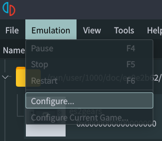
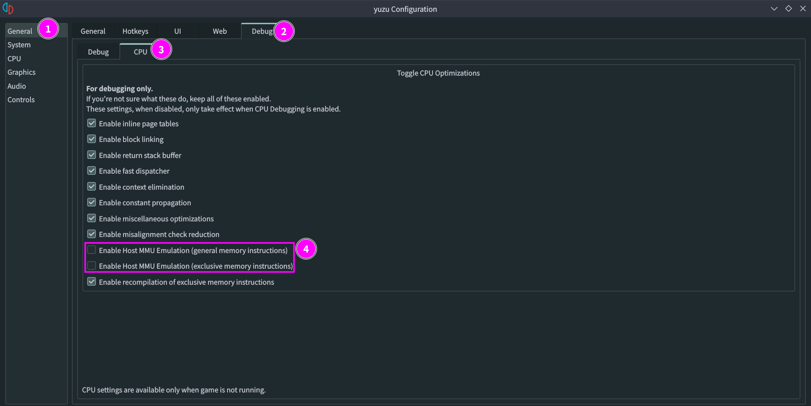
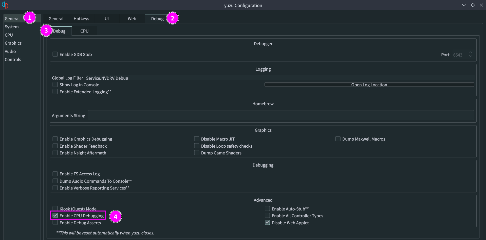

# Flatpak for Yuzu Emulator

Yuzu is an experimental Nintendo Switch emulator. For more information, please [visit our website](https://yuzu-emu.org/).

To install the Flatpak version of Yuzu Emulator, please visit <https://flathub.org/apps/details/org.yuzu_emu.yuzu>.

For issues with basic functionality and usage, please use our [Community Forum](https://community.citra-emu.org/) or join our [Discord channel](https://discord.gg/u77vRWY).

## Reporting Bugs

If you encounter any crashes or stability issues, please report them in the issues section of this repository.

When reporting, make sure to select the appropriate template and follow the instructions in the template.

### Obtaining Necessary Information for Bug Reports

Since Yuzu is a complex piece of software, it's very difficult to pinpoint a specific issue. Providing necessary contextual information will help us determine the root cause of the problem you are experiencing.

Usually, yuzu's own log file will reveal the issue. Please see [How to obtain the log file](https://yuzu-emu.org/help/reference/log-files/) for information on how to collect the log file from your system.

Sometimes, yuzu's own log file is insufficient to determine the cause, especially if you are reporting a crash or a freeze.
Ideally, we will able to reproduce the issue on our own machines. But there are times when we can't reproduce the crash or freeze on our own machines due to hardware differences. This would require you to provide a debugger trace.
Obtaining a debugger trace is a bit complicated, so please bear with us:

#### Obtaining a debugger trace after the crash

1. Install debuggers in Flatpak: `flatpak install org.kde.Sdk//5.15-23.08`
2. Install debug information for yuzu: `flatpak install org.yuzu_emu.yuzu.Debug`
3. Execute this command in your terminal: `flatpak-coredumpctl org.yuzu_emu.yuzu -m yuzu --gdb-arguments "--batch -ex 'thread apply all bt'" > /tmp/yuzu-backtrace.log`
4. Please attach the file `/tmp/yuzu-backtrace.log` file to your report

#### Obtaining a debugger trace as the crash happens

1. Install debuggers in Flatpak: `flatpak install org.kde.Sdk//5.15-23.08`
2. Install debug information for yuzu: `flatpak install org.yuzu_emu.yuzu.Debug`
3. Execute this command in your terminal: `flatpak run --devel --command=sh org.yuzu_emu.yuzu`
4. Type `gdb /app/bin/yuzu` in the coming up prompt and wait for the `(gdb)` prompt to show up
5. Type <kbd>r</kbd> and hit <kbd>Enter</kbd> to launch yuzu under the debugger
6. **Before loading your game**:
    - Go to `Emulation` -> `Configure ...` menu:  
    - Choose `General` on the left-sidebar, then choose `Debug` tab on the right panel. And then, select the `CPU` tab on the second-level panel, you will see the `Toggle CPU optimizations` options. Please **uncheck both** the **Enable Host MMU Emulation (general memory instructions)** and **Enable Host MMU Emulation (exclusive memory instructions)** checkboxes (as those would interfere with the debugger)   
    - Then go to the `Debug` tab and **check** the `Enable CPU Debugging` checkbox  and click the `Confirm` button at the buttom of the dialog.
7. Load the game that caused the crash and repeat the steps you think that may have crashed or freezed yuzu
8. When the crash or freeze happens, switch back to the terminal and type `bt` at the `(gdb)` prompt
9. If `gdb` asks `--Type <RET> for more, q to quit, c to continue without paging--`, type <kbd>c</kbd> to show all the output
10. Copy and paste all the output to a new text file, and attach this file to your report
11. Type <kbd>q</kbd> to kill both the debugger and crashed yuzu
12. (Optional) You might want to undo step (6) to avoid performance penalty after this process
